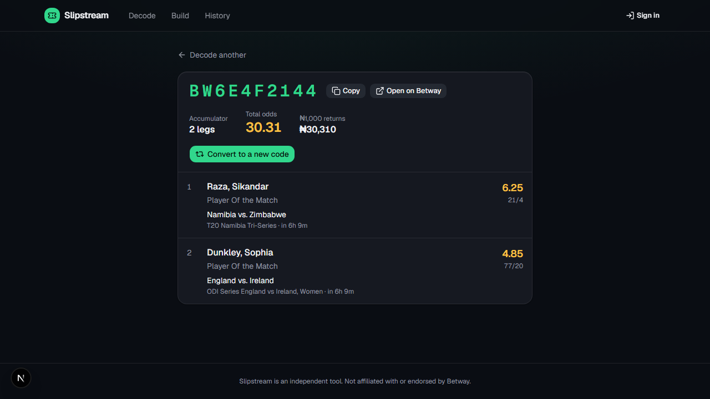
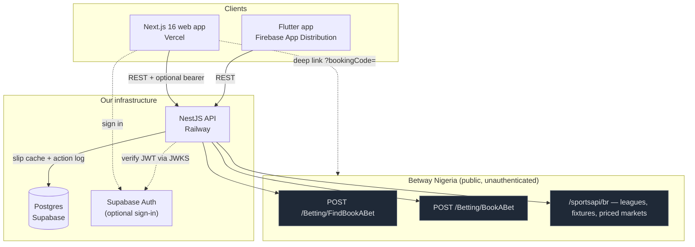
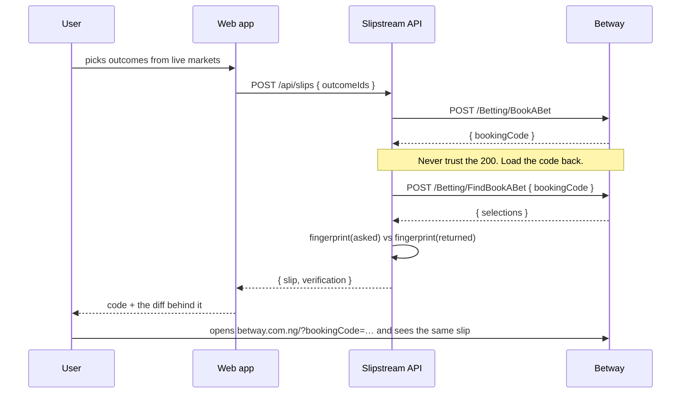
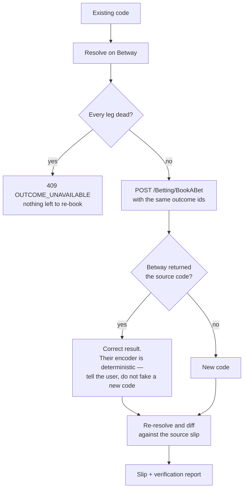
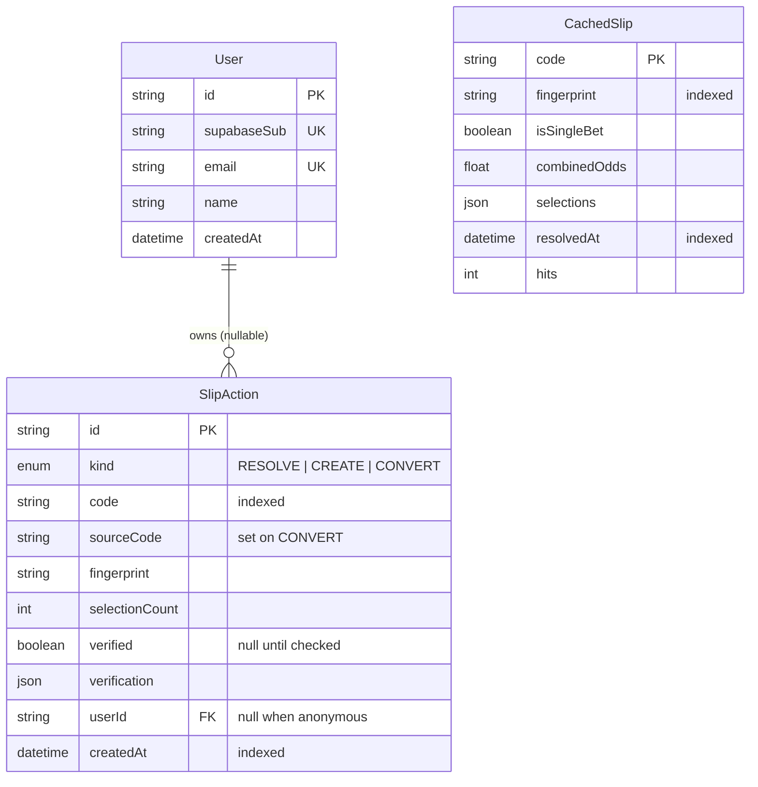

# Slipstream

Decode, build, convert and **verify** Betway Nigeria booking codes.

Paste a code to see every leg, market and price on it. Build a new slip from
Betway's live prices and get a booking code back. Take an existing slip and
re-book it as a code for the same bet. Every code the app produces is loaded
back off Betway and diffed against the bet you asked for, and you are shown
that diff rather than a green tick.

| | |
|---|---|
| **Web** | _(deploy URL — see [Deploying](#deploying))_ |
| **API** | _(Railway URL)_ · OpenAPI at `/docs` |
| **Android** | Firebase App Distribution, built by [`mobile.yml`](.github/workflows/mobile.yml) |



---

## Contents

- [How it works](#how-it-works)
- [The Betway integration](#the-betway-integration)
- [Architecture](#architecture)
- [Verification](#verification)
- [Design decisions](#design-decisions)
- [Data model](#data-model)
- [Running it](#running-it)
- [Testing](#testing)
- [Deploying](#deploying)
- [The iOS path](#the-ios-path)
- [Where AI was used](#where-ai-was-used)
- [Known limitations](#known-limitations)

---

## How it works

A Betway booking code is a pointer to a set of selections held on Betway's
servers. There is nothing to decrypt: the code is looked up, not decoded. So
all three features reduce to two upstream calls.

| Feature | What actually happens |
|---|---|
| **Decode** | `POST /Betting/FindBookABet` with the code → Betway returns the selections. We normalise them into our own `Slip` contract. |
| **Create** | `POST /Betting/BookABet` with a list of outcome ids → Betway mints a code. We then re-resolve that code and diff it against what we sent. |
| **Convert** | Decode the source code, take its outcome ids, mint a new code from them, verify the result against the source slip. |
| **Verify** | Re-resolve a code and compare its *fingerprint* — the sorted set of outcome ids — with the bet we expected. |

---

## The Betway integration

Betway publishes no API documentation. Everything below was derived by reading
their production Nuxt bundle, then confirmed against the live endpoints.

Their client builds a request as `baseUrl + "/" + apiVersion + path`, with
`bettingDomain` = `https://www.betway.{tld}/appsynapse/bet-api-sr`, so:

```
BASE = https://www.betway.com.ng/appsynapse/bet-api-sr/v1
```

**The endpoints are entirely public.** No API key, no session, no bot
challenge, no rate limiting we could provoke.

```http
POST {BASE}/Betting/FindBookABet
{ "countryCode": "NG", "bookingCode": "BW6E15DE93", "cultureCode": "en-US" }
→ 200 { "selections": [...], "isSingleBet": false, "isBuildABet": false }
→ 400 { "errorCode": 6000331, "errorMessage": "BookABetInvalidCode" }
→ 400 { "errorCode": 6000332, "errorMessage": "BookABetSelectionsExpired" }

POST {BASE}/Betting/BookABet
{ "cultureCode": "en-US", "countryCode": "NG", "isSingleBet": false,
  "outcomes": [{ "outcomeId": "6330296311" }] }
→ 200 { "bookingCode": "BW6E423A7B" }
```

The selection builder uses their sports feeds at
`https://www.betway.com.ng/sportsapi/br`:
`/v1/Feeds/RegionsAndLeagues/{sportId}`, `/v2/FeedsEvent/Events`, and
`/v1/Feeds/EMOP` (150+ priced markets for a single football match).

A booking code opens on Betway itself at
`https://www.betway.com.ng/?bookingCode=<CODE>` — their SPA reads
`route.query.bookingCode` and opens its betslip drawer.

### Four things the live tests taught us

Each of these was found by running against production, and each is handled
rather than assumed. They are the reason `apps/api` has a separate opt-in
[live suite](apps/api/src/betway/betway.live.ts).

**1. Betway's encoder is deterministic on the *ordered* outcome list.**
Posting the same outcomes twice returns the same code. Posting them in a
different order returns a *different* code. `isSingleBet` is not part of that
key at all.

```
[a, b] → BW6E49147A      [b, a] → BW6E49148E      [a, b] again → BW6E49147A
```

This is the single most important finding in the project, and it is why
`slipFingerprint` exists — see [Verification](#verification).

**2. Outcome ids are not integers.** Line markets encode the line into the id
itself: `"6838053018total=3.5~12"` is a real Over 3.5 outcome. Anything that
parses, stores or validates an outcome id must treat it as an opaque string.
An early version of the live test asserted `/^\d+$/`, and that is how we
found out.

**3. There are two user-facing upstream errors, not one.** `6000331`
(invalid code) and `6000332` (selections expired) both arrive as a bare HTTP
400 and are indistinguishable without the body — but one is a typo the user
can fix and the other is a slip that has aged out. They get separate error
codes and separate copy.

**4. Betway occasionally does not recognise a code it just minted.** Observed
twice, never reproducible on retry; it reads as replication lag. Only the code
paths that *just created* a code retry, because only they know for a fact that
the code exists. For every other caller, "invalid code" is the truth and must
be shown.

---

## Architecture



The Flutter app deliberately talks to **our** API rather than to Betway. The
mapping, fingerprinting and verification all stay server-side, so an upstream
change is fixed with a deploy instead of an app-store release.

### Creating a code, and proving it



### Converting, and why the code may not change



---

## Verification

> *"Load each generated or converted code on Betway's own site and demonstrate
> that the resulting slip matches the expected bet."*

**A booking code cannot be compared to another booking code.** Betway's
encoder is order-sensitive, so the same bet legitimately has several valid
codes, and the same code can be returned for a re-book. Comparing code strings
would fail correct conversions and pass nothing useful.

So identity is the **fingerprint**: the sorted, de-duplicated set of outcome
ids ([`slipFingerprint`](packages/shared/src/slip.ts)). Order-independent,
because the order legs were picked in is not part of the bet.

Verification then means: re-resolve the code against Betway, and diff.

| Signal | Fails the check? | Why |
|---|---|---|
| A leg is missing | **Yes** | The code does not carry the bet. This is the failure that would cost someone money. |
| An extra leg appeared | **Yes** | Same. |
| A price moved | No | Odds move continuously between the encode call and the verify call. Failing on drift would cry wolf on every busy market — it is reported, not fatal. |

This runs at three levels:

1. **In the product.** `POST /api/slips` and `/convert` never report success
   on Betway's 200 alone; they re-resolve and return the diff, which the UI
   renders as evidence rather than a tick.
2. **In the API's live suite** — `pnpm --filter @slipstream/api test:live`
   does decode → encode → decode against production and asserts the
   fingerprints match.
3. **In a real browser** —
   [`e2e/betway-verification.spec.ts`](apps/web/e2e/betway-verification.spec.ts)
   generates a code, opens `betway.com.ng/?bookingCode=…` in Chromium, asserts
   Betway's own betslip shows the same fixtures, and writes screenshots to
   `docs/verification/`.

> **Note:** level 3 could not be executed inside the sandboxed environment this
> was built in — outbound browser traffic to any `betway.com.ng` path or query
> is refused there, while the bare host resolves, so it is an egress
> restriction rather than a product failure. The suite now fails with a message
> that says exactly that. Levels 1 and 2 run green against live Betway and
> cover the same guarantee without a browser. **Run
> `pnpm --filter @slipstream/web test:e2e betway-verification` from an
> unrestricted network to produce the screenshots.**

---

## Design decisions

**Auth is optional, and that is the product decision, not a shortcut.** A
booking code is a thing people paste to each other in group chats. Putting a
login in front of that would make the app worse at its main job. Everything —
decode, build, convert, verify — works signed out. Signing in adds one thing:
a durable history of the codes you have touched. A *missing* token yields an
anonymous principal; an *invalid* one is still a hard 401, because silently
downgrading a rejected session would show someone an empty history and call it
theirs.

**Postgres is a supporting store, not the source of truth.** Betway holds the
state. Our database holds a short-lived slip cache and an action log, so a
database that will not connect *degrades* the app rather than stopping it —
`PrismaService` logs and continues, and every write is best-effort. Refusing to
boot would take the whole product down to protect two features nobody needs in
order to get a booking code.

**The cache TTL is 60 seconds, and that is not a performance number.** It
exists to be a good citizen when one code goes around a WhatsApp group. Odds
move continuously, so anything longer would serve a slip that is quietly wrong
in the one number people actually read. Any path that is about to produce a
verification bypasses the cache entirely.

**Dark-only UI, deliberately.** A betslip is a dense table of numbers read on
a phone, at night, one-handed. A dark ground lets odds carry the only warm
colour on the page, which is where the eye should land. Two mediocre themes
would have been worse than one committed one. Three accents, one job each:
jade for actions and "verified", amber for odds and money *only*, rose for a
dead leg or a failed check.

**Loose upstream types, strict internal ones.** `betway.types.ts` marks almost
everything optional. Betway ships new fields into these payloads regularly, and
a strict interface would turn an additive upstream change into a 500.
Validation happens at our own boundary, in the mapper, which is also the only
file that knows a Betway field name.

**Where the payloads disagree with themselves, the nested object wins.** A
price appears as both `selection.priceDecimal` and
`selection.price.priceDecimal`. They do not always agree — the flattened copy
is a snapshot from booking time, while the nested object is what Betway keeps
current.

**The mapper fails a leg rather than dropping it.** A selection with no
outcome id or no usable price throws. Dropping it would produce a "converted"
code silently missing a leg, which is the one bug this product exists to
prevent; defaulting a missing price to 1.00 would understate the return.

---

## Data model



`CachedSlip` is keyed by code but **indexed by fingerprint**, which answers
the question a code cannot: *has this exact bet already been booked under
another code?*

`SlipAction.userId` is nullable because anonymous use is a first-class path —
the log still records what happened, it simply belongs to nobody.

---

## Running it

**Prerequisites:** Node 20+, pnpm 9, and a Postgres database (optional — the
app runs without one, minus cache and history).

```bash
pnpm install

cp apps/api/.env.example apps/api/.env       # DATABASE_URL, WEB_ORIGIN, Supabase
cp apps/web/.env.example apps/web/.env.local # NEXT_PUBLIC_API_URL, Supabase

pnpm --filter @slipstream/api exec prisma migrate deploy   # if you have a DB
pnpm dev                                                   # api :4000, web :3000
```

The API serves OpenAPI docs at `http://localhost:4000/docs`.

**Flutter:**

```bash
cd apps/mobile
flutter create --org com.slipstream --project-name slipstream --platforms=android .
flutter run --dart-define=API_URL=http://10.0.2.2:4000   # 10.0.2.2 = host, from the emulator
```

### API surface

| Method | Path | |
|---|---|---|
| `GET` | `/api/slips/:code` | Decode |
| `POST` | `/api/slips` | Create from `{ outcomeIds, isSingleBet }` |
| `POST` | `/api/slips/:code/convert` | Convert |
| `GET` | `/api/slips/:code/verify?outcomeIds=a,b` | Verify a code against an expected bet |
| `GET` | `/api/slips/history` | Signed-in history |
| `GET` | `/api/catalogue/sports` · `/sports/:id/regions` · `/events` · `/events/:id/markets` | Builder catalogue |

---

## Testing

```bash
pnpm test                                        # all hermetic suites
pnpm --filter @slipstream/api test:live          # hits real Betway (opt-in)
pnpm --filter @slipstream/web test:e2e           # Playwright, needs dev servers
```

| Suite | What it protects |
|---|---|
| `packages/shared` (8) | The fingerprint rules — order-independence, de-duplication, empty slips. |
| `apps/api` (23) | Mapper against a **recorded live payload**; the encode/convert/verify logic against a faked Betway, including a dropped leg, odds drift, an all-dead slip, and de-duplicated requests. |
| `apps/web` (11) | Code normalisation (pasted from chat apps) and kickoff/odds formatting. |
| `apps/mobile` | Contract parsing and the `code`-not-status error path. |
| `apps/web/e2e` (5) | The real app against live Betway data — and the source of the screenshots in this README. |
| `betway.live.ts` (6) | The upstream contract itself, including the determinism finding. |

The hermetic suites never touch the network. The live ones are opt-in and run
as a `continue-on-error` CI job: a Betway outage must not be able to block a
merge, but a silent upstream contract change must still be visible.

---

## Deploying

**API → Railway.** Root directory `/` (the repo root — the Dockerfile needs
`pnpm-workspace.yaml`, the lockfile and `packages/shared`), Dockerfile path
`apps/api/Dockerfile`. `railway.json` must live at the repo root, or Railway
never reads it and falls back to an auto-detector that cannot tell which
workspace package to run.

Environment: `DATABASE_URL`, `DIRECT_URL`, `SUPABASE_URL`,
`SUPABASE_JWKS_URL`, `WEB_ORIGIN`. `WEB_ORIGIN` is asserted at boot — the API
refuses to start without it, because an unset value would let the web app
render perfectly while every request failed CORS.

**Web → Vercel.** Root directory `apps/web`. Set `NEXT_PUBLIC_API_URL`,
`NEXT_PUBLIC_SUPABASE_URL`, `NEXT_PUBLIC_SUPABASE_ANON_KEY`. These are inlined
at build time, so changing one without redeploying has no effect —
`lib/api.ts` throws at import if the API URL is missing rather than silently
issuing requests to `undefined/api/...`.

**Android → Firebase App Distribution**, via
[`mobile.yml`](.github/workflows/mobile.yml). Needs repository variable
`API_URL` and secrets `FIREBASE_APP_ID` and `FIREBASE_SERVICE_ACCOUNT` (a
service-account JSON with the *Firebase App Distribution Admin* role). Testers
go in a group named `testers`.

---

## The iOS path

The Dart in `apps/mobile/lib` is already platform-neutral; nothing in the app
needs to change. What changes is everything around the build.

| | Android (today) | iOS |
|---|---|---|
| Runner | `ubuntu-latest` | `macos-latest` — Xcode only exists on macOS, and those minutes bill at ~10× |
| Scaffolding | `flutter create --platforms=android` | add `ios`; also needs a bundle id registered in the Apple Developer portal |
| Identity | none | Apple Developer Program membership, US$99/yr |
| Signing | debug keystore is enough for App Distribution | an Apple **distribution certificate** + an **ad-hoc or enterprise provisioning profile**, imported into a temporary keychain on the runner |
| Device registration | none — an APK installs anywhere | ad-hoc profiles embed a list of UDIDs; **every tester device must be registered in advance**, and adding one means re-generating the profile and rebuilding |
| Artifact | `flutter build apk --release` | `flutter build ipa --export-options-plist=…` |
| Upload | `wzieba/Firebase-Distribution-Github-Action` | the same action — App Distribution takes IPAs too |

The real friction is not the build, it is identity. Android distribution needs
no Apple relationship; iOS needs a paid account, certificates that expire
annually, and provisioning profiles tied to specific devices. In practice you
manage the certificates with [fastlane match](https://docs.fastlane.tools/actions/match/)
(certs in a private git repo, decrypted onto the runner) rather than by hand,
and for anything beyond a handful of testers you use **TestFlight** instead of
ad-hoc distribution, since TestFlight does not require UDID registration.

---

## Where AI was used

Built with Claude Code (Opus 5) throughout, and the process is worth
describing because the interesting work was not code generation.

- **Reverse-engineering the API.** The `_nuxt` bundle was fetched and grepped
  for endpoint literals, the runtime-config block was extracted to resolve
  `bettingDomain`, and the request-builder function was read to work out that
  the URL is `baseUrl + "/" + apiVersion + path`. Every hypothesis was then
  confirmed with `curl` against production before a line of app code existed.
- **Finding the determinism quirk.** Posting the same outcomes reordered and
  comparing the returned codes was a deliberate probe, not an accident, and it
  changed the design of the entire verification layer.
- **Fixtures from Betway's own CMS.** The curated feed at
  `config.betwayafrica.com/cron/bookingcode/synapse/BW` supplies real, live
  booking codes, so the tests never depend on a hard-coded code that rots
  within a week.
- **The platform layer was reused** from a previous project of mine (pnpm
  workspace, Dockerfile, error envelope, Supabase auth, Playwright config).
  The domain layer is new.

The live-test failures were the most valuable part of the process: three of
the four upstream findings above came from a test failing against production
in a way that was initially indistinguishable from a bug in our own code.

---

## Known limitations

- **Betway's browser-side verification has not been executed here** — see the
  note in [Verification](#verification). The code is written and the failure
  mode is explicit; it needs a network that permits `betway.com.ng`.
- **Nigeria only.** `countryCode` is configurable and Betway Africa uses the
  same platform across ZA/GH/KE/TZ, so other countries are a config change —
  but none of them have been tested.
- **The builder covers six sports** with an explicit allow-list. Betway
  carries many more, but each needs its market layout checked by hand, and an
  unchecked sport renders worse than an absent one.
- **No live odds streaming.** Betway pushes price updates over SignalR
  (`signalrapi.betwayafrica.com`); we poll on a 15-second stale time instead.
  Prices on screen can be seconds old, which is why odds drift is surfaced in
  the verification report rather than hidden.
- **The Flutter app decodes only.** Building and converting are web-only; the
  brief asked for the slip view, and a full builder on a phone is a bigger
  design job than a rough one-screen view.
- **`isSingleBet` round-trips imperfectly.** Betway ignores it when minting a
  code, so a singles slip converted through us comes back as whatever Betway
  decides. The flag is preserved in what we send and reported in what comes
  back, but we cannot force it.

---

Slipstream is an independent tool. Not affiliated with or endorsed by Betway.
