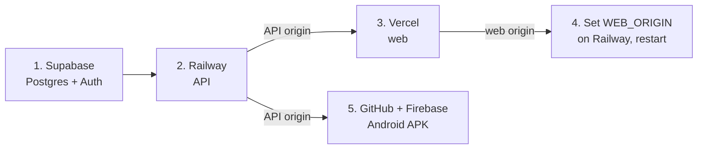

# Deployment runbook

Four services, in this order. The order matters: each step needs a value the
previous one produces.



---

## 1. Supabase — Postgres and Auth

Create a project, then from **Project Settings**:

| Value | Where |
|---|---|
| `DATABASE_URL` | Database → Connection string → **Transaction pooler** (port 6543). Append `?pgbouncer=true`. |
| `DIRECT_URL` | Database → Connection string → **Direct** (port 5432). Migrations must not go through the pooler. |
| `SUPABASE_URL` | API → Project URL |
| `SUPABASE_JWKS_URL` | `<SUPABASE_URL>/auth/v1/.well-known/jwks.json` |
| `NEXT_PUBLIC_SUPABASE_ANON_KEY` | API → Project API keys → `anon` / publishable |

Under **Authentication → Providers**, enable Email. For a demo account that
works immediately, turn *off* "Confirm email" — otherwise a reviewer has to
click a link in an inbox they do not have.

> No service-role key is needed. This API never acts on a user's behalf
> against Supabase; it only verifies JWTs against the public JWKS endpoint.

## 2. Railway — the API

New service → deploy from the GitHub repo.

| Setting | Value |
|---|---|
| Root directory | `/` — the **repo root**, not `apps/api` |
| Dockerfile path | `apps/api/Dockerfile` |
| Start command | `node dist/main.js` (already in `railway.json`) |
| Release command | `node_modules/.bin/prisma migrate deploy --schema prisma/schema.prisma` (already in `railway.json`) |

Two traps worth stating explicitly, both of which cost time on a previous
project:

- **Root directory must be `/`.** The Dockerfile needs `pnpm-workspace.yaml`,
  the root lockfile and `packages/shared` to resolve the workspace. `apps/api`
  alone is not a buildable context.
- **`railway.json` must be at the repo root.** Railway reads its config from
  the top of the service's root directory, so a copy inside `apps/api` is
  silently ignored — Railway then falls back to its auto-detector, finds a
  three-package pnpm workspace, cannot tell which one to run, and fails with
  "No start command detected". That reads like a missing script; the actual
  cause is a config file it never opened.

Environment variables:

```
DATABASE_URL, DIRECT_URL, SUPABASE_URL, SUPABASE_JWKS_URL
WEB_ORIGIN            # set in step 4 — the API refuses to boot without it
BETWAY_COUNTRY_CODE=NG
PORT                  # injected by Railway, do not set
```

Generate a public domain under **Settings → Networking**. Check
`https://<api>/docs` renders the OpenAPI page.

## 3. Vercel — the web app

Import the repo. **Root directory: `apps/web`.** Vercel detects Next.js and
the pnpm workspace on its own.

```
NEXT_PUBLIC_API_URL=https://<railway-domain>     # no trailing slash, no /api
NEXT_PUBLIC_SUPABASE_URL=https://<project>.supabase.co
NEXT_PUBLIC_SUPABASE_ANON_KEY=<anon key>
```

These are inlined at build time. Changing one without redeploying has no
effect, which is why `lib/api.ts` throws at import when the API URL is
missing — the alternative is an app that renders perfectly while every request
404s against its own origin.

## 4. Close the CORS loop

Set `WEB_ORIGIN` on Railway to the Vercel domain (comma-separated for several,
e.g. `https://slipstream.vercel.app,https://slipstream-git-main.vercel.app`)
and restart. No rebuild is needed — it is read at boot.

Until this is done, the web app loads and every request fails CORS.

## 5. Android — GitHub Actions → Firebase App Distribution

In Firebase: create a project, add an **Android app** with package name
`com.slipstream.slipstream`, and create a service account with the
**Firebase App Distribution Admin** role (Project Settings → Service accounts
→ Generate new private key). Under App Distribution, create a tester group
called `testers`.

In the GitHub repo:

| Kind | Name | Value |
|---|---|---|
| Variable | `API_URL` | the Railway domain |
| Secret | `FIREBASE_APP_ID` | Firebase → Project settings → your Android app → App ID (`1:…:android:…`) |
| Secret | `FIREBASE_SERVICE_ACCOUNT` | the whole service-account JSON, pasted |

Then run the **Android APK → Firebase App Distribution** workflow (it also
fires on any push touching `apps/mobile/**`). The APK is attached to the run
as an artifact either way; distribution is skipped rather than failed if the
secrets are absent.

---

## Verifying a deploy

```bash
# API is up and serving without touching a database
curl https://<api>/api/catalogue/sports

# a real decode, end to end
curl https://<api>/api/slips/BW6E15DE93

# the whole app against the deployed URL
E2E_WEB_URL=https://<web> E2E_API_URL=https://<api> \
  pnpm --filter @slipstream/web test:e2e

# the browser-side Betway proof — needs a network that permits betway.com.ng
E2E_API_URL=https://<api> \
  pnpm --filter @slipstream/web test:e2e betway-verification
```

The last one writes screenshots of Betway's own betslip to
`docs/verification/`. It is the artefact behind the verification deliverable,
and it is the one step that cannot be run from a restricted network.

## Rollback

Railway and Vercel both keep previous deployments — redeploy the last good
one from the dashboard. Database migrations are additive only so far, so a
rollback of the API does not require a database rollback.
